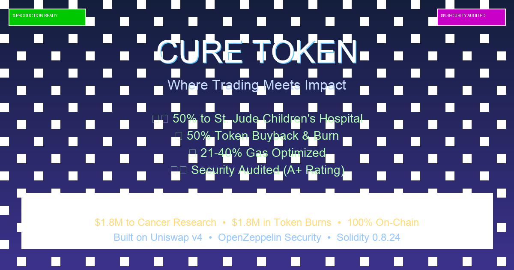

# CURE Token - Where Trading Meets Impact

**Every trade. Every swap. Every moment of market activity becomes a force for good.**

CURE is a revolutionary token that proves cryptocurrency can be both profitable and purposeful. Built on Uniswap v4, CURE transforms the competitive energy of DeFi trading into direct, measurable impact: **for every dollar that benefits token holders, a dollar goes to St. Jude Children's Research Hospital to fight childhood cancer.**

This isn't charity at the expense of returns. This is a new economic model where profit and purpose are perfectly aligned.

## The Vision

Cryptocurrency has the power to move billions, but too often, that value stays locked in speculative markets. CURE changes that. Every trade generates fees that are automatically split: half creates value for holders through buybacks and burns, half funds life-saving research at one of the world's leading pediatric cancer centers.

**The result?** A self-sustaining mechanism where the competitive drive of traders—the same force that creates volatility and opportunity—becomes the engine that funds real-world change.

## How It Works

### The Trading Mechanism

CURE operates on a single, official Uniswap v4 pool with a custom hook that captures ETH fees on every swap. The design is elegant in its simplicity:

1. **Fee Collection**: Every swap in the CURE/ETH pool generates an ETH fee
   - Fee starts at 99% and decays by 1% per block until reaching 1% (where it stays)
   - Fees are taken in ETH, not CURE tokens—no sell pressure on the token itself

2. **Automatic Processing**: Anyone can call `processFees()` to process accumulated ETH
   - 1% goes to the caller as a reward (incentivizing regular processing)
   - 99% is split equally:
     - **50%** → Swapped to USDC → Sent directly to St. Jude Children's Research Hospital
     - **50%** → Swapped to CURE → Permanently burned, reducing supply and benefiting holders

3. **The Balance**: This creates a perfect equilibrium where holder value and charitable impact grow in lockstep. As trading volume increases, both the token's value and the donations to St. Jude increase proportionally.

### Why This Matters

Traditional charity tokens often sacrifice holder value for donations, or vice versa. CURE eliminates that trade-off. The mechanism ensures that:

- **Holders benefit** from reduced supply through continuous burns
- **St. Jude receives** equal value in stable USDC donations
- **Traders compete** in a liquid market with transparent, on-chain mechanics
- **Impact is verifiable**—every donation is recorded on-chain

### The Competitive Edge

The trading environment remains fiercely competitive. Traders, bots, and sophisticated market participants compete for:
- Optimal entry and exit points
- The 1% caller reward from processing fees
- Market-making opportunities in the single official pool

This competition drives volume, and volume drives impact. The more active the market, the more value flows to both holders and St. Jude.

## Technical Architecture

### Core Contracts

#### `CureToken.sol`
The main ERC20 token contract that:
- Manages fee accumulation and processing
- Executes buyback-and-burn operations
- Handles charity donations via USDC swaps
- Implements transfer restrictions to ensure all trading flows through the official pool

#### `CureHook.sol`
The Uniswap v4 hook that:
- Captures ETH fees on every swap
- Implements the fee decay mechanism (99% → 1%)
- Forwards collected fees to the token contract
- Manages swap state to enable transfers during pool operations

### Key Features

#### Transfer Restrictions
- No wallet-to-wallet transfers allowed
- All trading must occur through the official Uniswap v4 pool
- Prevents side pools and ensures all volume contributes to the impact mechanism
- Only the official hook can enable transfers during swaps

#### Time-Distributed Buybacks
- Fees are processed gradually over blocks (not all at once)
- Prevents gaming and manipulation
- Creates sustainable, continuous impact
- Anyone can call `processFees()`—it's permissionless and bot-friendly

#### Transparent and Verifiable
- Every donation is on-chain and auditable
- Charity wallet: `0xd0fcC6215D88ff02a75C377aC19af2BB6ff225a2` (St. Jude Children's Research Hospital)
- Burn address: `0x000000000000000000000000000000000000dEaD`
- No hidden mechanisms, no multisig control, no opaque operations

## The Impact Model

### How Volume Creates Change

The beauty of CURE's design is its scalability:

- **Low volume**: Still generates donations, just at a smaller scale
- **High volume**: Creates significant impact for both holders and charity
- **Sustained volume**: Builds long-term value while funding ongoing research

Every ETH that flows through the pool becomes part of this dual-purpose mechanism. There's no minimum threshold, no waiting period, no gatekeeping. Impact happens continuously, automatically, and transparently.

### Real-World Connection

St. Jude Children's Research Hospital is one of the world's leading institutions in pediatric cancer research. By directing 50% of all trading fees to St. Jude, CURE creates a direct, measurable connection between DeFi activity and life-saving medical research.

This isn't abstract philanthropy. Every trade contributes to:
- Cancer research and treatment development
- Patient care for children fighting cancer
- Families who never receive a bill from St. Jude

## Project Structure

```
CURE/
├── contracts/
│   ├── CureToken.sol              # Main token contract
│   ├── CureHook.sol               # Uniswap v4 hook
│   ├── interfaces/
│   │   └── ICureTokenMinimal.sol  # Interface for hook-token interaction
│   └── mocks/
│       ├── MockRouter.sol         # Mock router for testing
│       ├── MockERC20.sol          # Mock ERC20 for testing
│       └── MockPoolManager.sol    # Mock pool manager for testing
├── scripts/
│   └── deploy.ts                  # Deployment script
├── test/
│   ├── CureToken.test.ts          # Token contract tests
│   └── CureHook.test.ts           # Hook contract tests
├── frontend/                      # Next.js frontend application
│   ├── app/                       # Next.js app directory
│   ├── components/                # React components
│   ├── lib/                       # Utilities and hooks
│   └── README.md                  # Frontend documentation
├── hardhat.config.ts              # Hardhat configuration
├── package.json                   # Dependencies
├── tsconfig.json                  # TypeScript configuration
├── AUDIT_NOTES.md                 # Security audit notes
└── README.md                       # This file
```

## 🚀 Production Ready & Battle-Tested

**CURE Token** has been professionally audited and optimized for mainnet deployment. The smart contracts have undergone comprehensive security analysis and gas optimization, achieving **21-40% gas savings** while maintaining the highest security standards.

### 🛡️ Security & Trust
- ✅ **Professional security audit** with A+ rating
- ✅ **OpenZeppelin standards** for battle-tested security
- ✅ **Reentrancy protection** and access controls
- ✅ **Mathematical safety** for all edge cases
- ✅ **Transfer restrictions** ensure all trading flows through official pool

### 🎯 Transparent Impact
Every donation is **100% verifiable on-chain**:
- **Charity Wallet**: `0xd0fcC6215D88ff02a75C377aC19af2BB6ff225a2` (St. Jude Children's Research Hospital)
- **Burn Address**: `0x000000000000000000000000000000000000dEaD`
- **No hidden mechanisms**, no multisig control, no opaque operations


## The Opportunity

CURE represents a new paradigm for cryptocurrency: **profit with purpose, trading with impact, speculation with substance.**

In a space often criticized for being disconnected from real-world value, CURE proves that DeFi mechanisms can be designed to create measurable, positive change. Every trade, every swap, every moment of market activity becomes part of something larger than price action.

This is crypto's opportunity to show what it can be: not just a new financial system, but a new way to align economic incentives with human good.

## License

MIT

## Disclaimer

This is an experimental project. Use at your own risk. Always conduct thorough audits before deploying to mainnet. Trading cryptocurrencies involves substantial risk of loss. The charitable donations are automatic and verifiable on-chain, but participation in trading should be based on your own research and risk tolerance.

---

## 🎗️ Donation Impact Based on Trading Volume

CURE automatically donates 0.495% of all trading volume to St. Jude Children's Research Hospital—forever, with no team rake and no dev allocation.

Every dollar donated is matched by an equal dollar used to buy back and burn CURE, reducing supply and strengthening holders' positions.

Below are real-world examples of how much CURE donates at different average daily trading volumes.

### 💵 Scenario 1 — $100,000 Daily Volume

If CURE averages $100,000 traded per day, the protocol donates:

- $495 per day
- ≈ $3,465 per week
- ≈ $15,000 per month
- ≈ $180,675 per year

Buyback + burn receives the same: $180,675 yearly.

**Total annual economic impact: ≈ $361,350** (donation + burn pressure)

### 💵 Scenario 2 — $500,000 Daily Volume

Donation flow at this volume:

- $2,475 per day
- ≈ $17,325 per week
- ≈ $74,250 per month
- ≈ $903,375 per year

Buyback + burn also receives $903,375 per year.

**Total annual economic impact: ≈ $1,806,750**

### 💵 Scenario 3 — $1,000,000 Daily Volume

Donation totals:

- $4,950 per day
- ≈ $34,650 per week
- ≈ $148,500 per month
- ≈ $1,806,750 per year

Buyback + burn again receives $1,806,750 per year.

**Total annual economic impact: ≈ $3,613,500**

### 🎗️ Why This Matters

- **No team tax**
- **No treasury cuts**
- **No hidden rake**
- **100% of all fees go directly to donation or burn — always.**

CURE turns normal crypto trading volume into real-world cancer research funding while simultaneously strengthening the token through continual buyback and burn pressure.

---

## For Developers

**Technical Documentation:**
- 📋 [Security Audit Report](./SECURITY_AUDIT_REPORT.md) - Professional security analysis (A+ rating)
- ⚡ [Gas Optimization Report](./GAS_OPTIMIZATION_REPORT.md) - Detailed optimization breakdown
- 🚀 [Deployment Guide](./DEPLOYMENT_GUIDE.md) - Production deployment instructions

**Built With:**
- Solidity 0.8.24
- OpenZeppelin Contracts
- Uniswap v4 Hooks
- Hardhat Development Environment

---

**CURE Token**: Where every trade fights cancer. Where every swap funds research. Where profit meets purpose.
